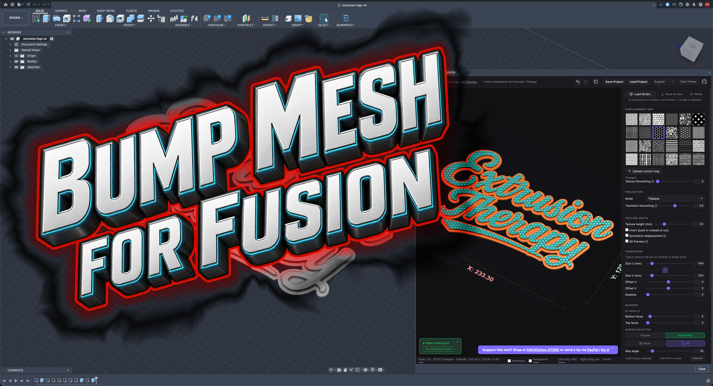

# BumpMesh for Fusion

Send a copy of an editable Autodesk Fusion solid body into BumpMesh, choose
the faces to texture there, and save the finished STL or 3MF. The
source Fusion body and its timeline are never modified.

## Workflow

1. Select one solid body in Fusion.
2. Run **BumpMesh** from the **BUMPMESH** panel.
3. BumpMesh opens in include-only mode with no surfaces selected, so texture is applied nowhere until you choose faces inside BumpMesh.
4. Choose **Export STL** or **Export 3MF**.
5. Choose the destination in Fusion's native save dialog.

The BumpMesh palette docks inside the right side of Fusion and scales to 48%
of the current modeling viewport, so it adapts to different screen sizes on
both macOS and Windows.

## Updates

Choose **Check for Updates** from the **BUMPMESH** menu. A newer compatible
release offers a download link; installation is always your choice.
Automatic checks run quietly about once a week while Fusion is running.
You can disable them in the same dialog and press **Done** to save the setting.
An available update is indicated in the menu, without interrupting your work.

BumpMesh loads some dependencies from the internet, so an internet connection
is required when those dependencies are not already cached.

## Install

Quit Fusion, download the installer for your computer, and run it. Reopen
Fusion and the **BumpMesh** button will appear in the **BUMPMESH** panel.

- [Download for macOS](https://github.com/rdcstout/BumpMeshForFusion/releases/latest/download/BumpMeshForFusion-macOS.pkg)
- [Download for Windows](https://github.com/rdcstout/BumpMeshForFusion/releases/latest/download/BumpMeshForFusion-Windows-Setup.exe)
- [Manual installation ZIP](https://github.com/rdcstout/BumpMeshForFusion/releases/latest/download/BumpMeshForFusion-Manual.zip)

### Manual installation

Download the manual installation ZIP and copy the complete `BumpMeshForFusion` folder
into the appropriate directory:

- macOS: `~/Library/Application Support/Autodesk/FusionAddins/`
- Windows: `%APPDATA%\Autodesk\FusionAddins\`

Restart Fusion after installing or updating the add-in.

## Development

Run the integration tests with `python3 -B -m unittest discover -s tests -v`
and `node --test tests/test_fusion_bridge.cjs` (Node 22 or newer).
Installer sources are under `packaging/`; the GitHub Actions workflow builds
the macOS package, Windows installer, and manual installation archive from the
same commit.
CI packages are build artifacts, not signed release approval. Public macOS
releases use `packaging/macos/build-release-pkg.sh` for signing, notarization,
stapling, and Gatekeeper verification. Installer versions must match the manifest.

### Uninstall

- macOS: run `Uninstall BumpMesh for Fusion.command` inside the installed
  `BumpMeshForFusion` folder, or remove that folder directly.
- Windows: open **Installed apps**, select **BumpMesh for Fusion**, and choose
  **Uninstall**.

## Support future tools

BumpMesh for Fusion is free and open source. If it helps in your shop, you can
optionally **[support future Extrusion Therapy tools](https://buy.stripe.com/fZu3cw2Mnfr0d7N3ws1kA00)**.
The installers and source remain available without payment.

## Attribution and license

BumpMesh is by CNC Kitchen (Stefan Hermann and contributors). The Fusion
integration is developed and maintained by Extrusion Therapy.

This project incorporates BumpMesh and is licensed under AGPL-3.0-only. See
`LICENSE`.

The bundled BumpMesh web application is based on
[CNCKitchen/stlTexturizer](https://github.com/CNCKitchen/stlTexturizer), commit
`a6ac179149b8a17c71a9469dd4cb6f866c0c01d1`.
